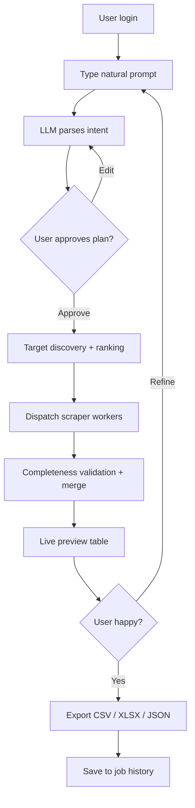
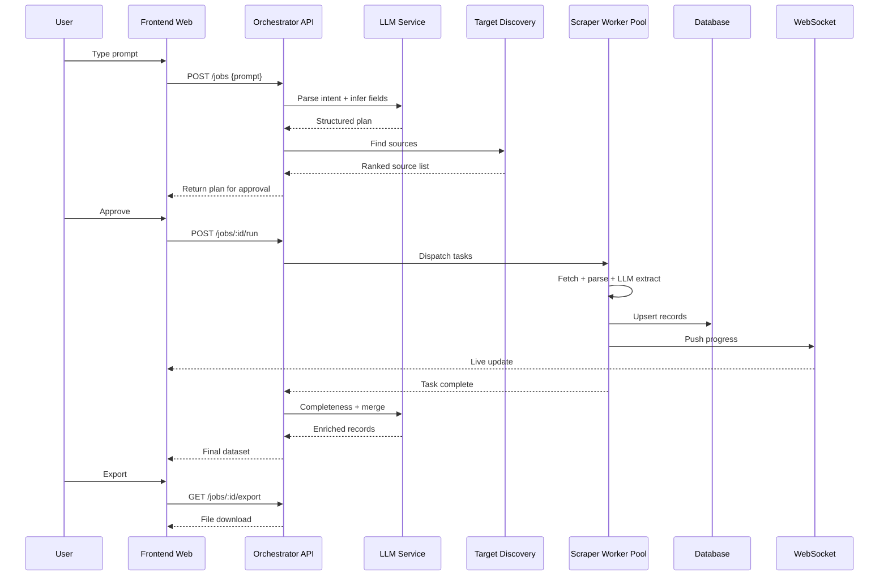
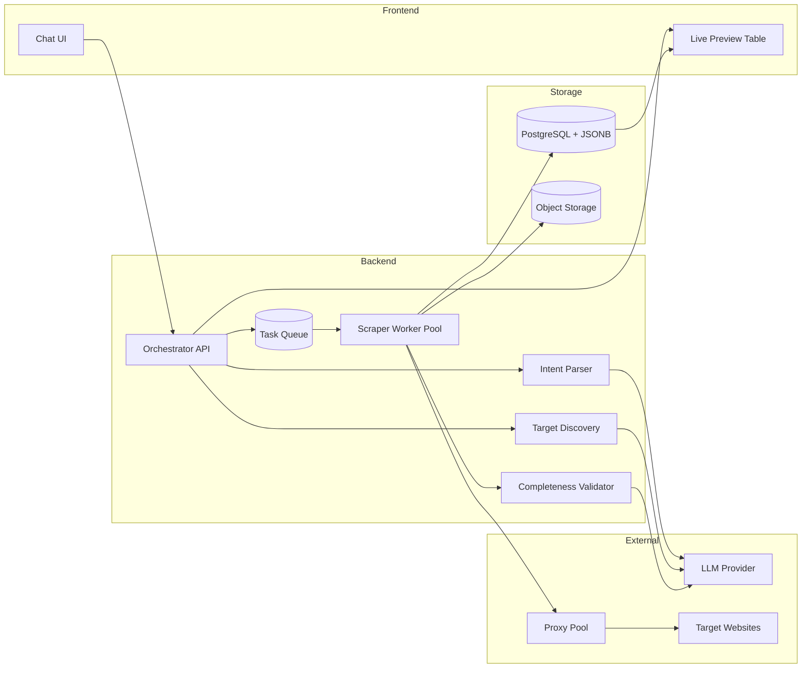
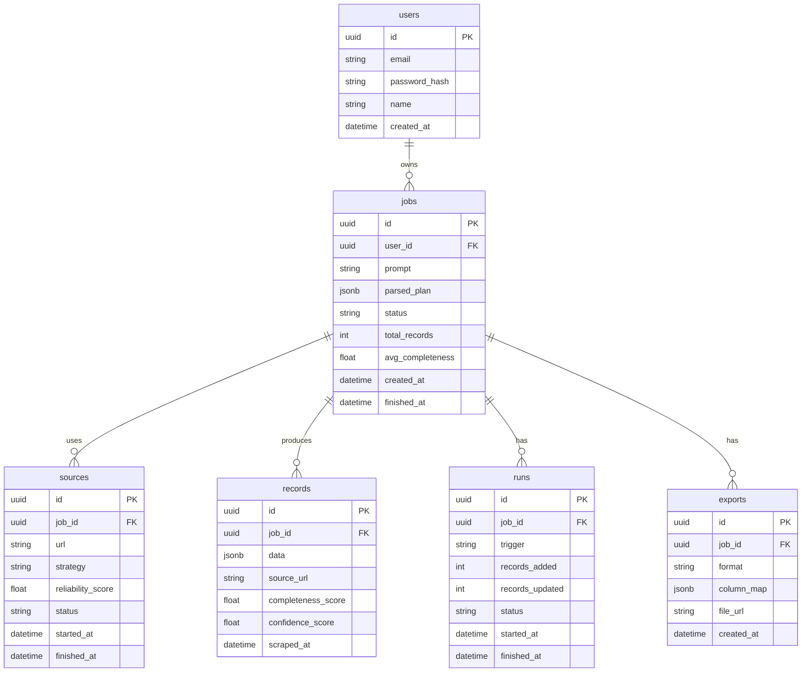

# PRD - PoiScrapper v3

> Advanced natural-language scraping tool. User cukup ngetik kebutuhan mereka, sistem otomatis cari sumber, scrape lengkap, validasi completeness, lalu kasih hasil siap export.

---

## 1. Overview

PoiScrapper v3 adalah tools scraping data yang dioperasikan dengan **prompt bahasa natural**. User cukup ngetik kebutuhan dalam satu kalimat — contoh: *"saya mau scrapping data dokter di RS Siloam Karawaci"* — dan sistem otomatis:

1. Memahami intent (entity, target scope, field yang dibutuhkan).
2. Menemukan sumber data yang relevan (website target, direktori publik, dsb).
3. Melakukan scraping adaptif (HTML statis, JS-rendered, API, PDF).
4. Memvalidasi kelengkapan data via cross-reference multi-source.
5. Menyajikan hasil di preview tabel real-time yang langsung bisa di-export.

**Problem:** Tools scraping existing (Octoparse, ParseHub, custom script) butuh user yang paham CSS selector / XPath / coding. Scope data juga sering **incomplete** karena user sering tidak tahu field apa saja yang seharusnya diambil, dan sulit menggabungkan data dari banyak sumber.

**Primary user:** Analyst, researcher, sales, marketer, journalist, founder — butuh data terstruktur dari web tanpa mau mikirin detail teknis scraping.

**Differentiator:** Natural-language interface + AI-driven target discovery + multi-source completeness guarantee — bukan sekadar "ketik URL".

---

## 2. Requirements

- **Accessibility:** Web app, browser modern (Chrome / Edge / Firefox / Safari terbaru). Desktop-first, optimal ≥ 1280px. Mobile viewable tapi bukan prioritas.
- **Users:** Single-user MVP → multi-user (workspace + role) di roadmap.
- **Authentication:** Email-password + OAuth (Google) untuk v1.
- **Data Input:** Natural-language prompt; opsional attach URL / file / sitemap sebagai seed.
- **Data Output:** CSV, XLSX, JSON. Google Sheets & Notion = roadmap.
- **Data Specificity:** Setiap record wajib punya `source_url`, `scraped_at`, `completeness_score`, `confidence_score`. Field domain-specific di-infer otomatis per prompt.
- **Notifications:** In-app toast + email saat job selesai / gagal / partial.
- **Localization:** UI Indonesia + English; konten scraping agnostik bahasa sumber.
- **Compliance:** Default obey `robots.txt` & ToS; override tersedia dengan warning modal tegas. PII detector + masking opsional. Tidak menyimpan credential sumber di log.

---

## 3. Core Features

1. **Natural-Language Prompt Interface**
   - Single input box ala chat. User ketik bebas (ID / EN).
   - Sistem balas dengan "scraping plan" yang bisa di-review / edit sebelum run.
   - Mendukung follow-up refinement (contoh: *"tambahin email dan nomor telpon"*, *"exclude dokter umum"*).

2. **Intent Parser (LLM-powered)**
   - Ekstrak struktur: `entity_type`, `target_scope`, `required_fields`, `filters`, `output_format`.
   - Auto-suggest field umum untuk entity tersebut supaya **tidak ada yang kelewat**.
   - Contoh: prompt *"data dokter di RS X"* → infer fields: `nama, gelar, spesialisasi, sub_spesialisasi, STR, SIP, jadwal_praktik, alamat_poli, email, telepon, pendidikan, pengalaman, foto_url, profile_url`.

3. **Target Discovery Engine**
   - Identifikasi sumber candidate: website resmi target, direktori publik (Alodokter, Halodoc, Klikdokter, Google Maps, LinkedIn publik, dsb).
   - Ranking by `reliability_score` (domain authority + field coverage + freshness).
   - Tampilkan daftar sumber ke user untuk approval sebelum execute.

4. **Adaptive Multi-Strategy Scraper**
   - **Static HTML:** HTTP fetch + parser (fastest path).
   - **JS-rendered:** Headless browser (Playwright) dengan wait-strategy.
   - **API reverse-engineering:** Deteksi XHR / fetch calls, preferensi hit API langsung.
   - **PDF / DOCX:** Text + table extraction.
   - **Anti-bot toolkit:** Proxy rotation, UA rotation, human-like delay, CAPTCHA solver hook, cookie / session replay.

5. **Data Completeness Validator**
   - Cross-reference record dari ≥ 2 sumber bila memungkinkan.
   - Tandai field kosong, coba isi dari sumber alternatif secara otomatis.
   - Hitung `completeness_score` per record (0–1) dan per job (rata-rata).
   - Deduplication fuzzy (nama + alamat + fingerprint lainnya).

6. **Live Preview & Export**
   - Tabel data update real-time via WebSocket selama scraping berjalan.
   - Filter, sort, edit manual, delete row, column mapping.
   - Export CSV / XLSX / JSON. Streamed untuk dataset besar.

7. **Job History & Re-run**
   - List semua job dengan status, record count, completeness, durasi.
   - One-click re-run untuk refresh data (incremental update + diff).
   - Clone job untuk scope berbeda (contoh: RS berbeda, field sama).

---

## 4. User Flow

1. **Login** — Email / Google OAuth.
2. **Prompt** — User ketik kebutuhan di chat box, misal *"saya mau scrapping data dokter di RS Siloam Karawaci"*.
3. **Plan Confirmation** — Sistem tampilkan rencana (entity, fields, sources, estimated record count & durasi). User edit / approve / tambah instruksi.
4. **Scraping Run** — Progress bar per source + live-updating preview table. User bisa pause / cancel.
5. **Review** — Tabel hasil dengan completeness score per record; user bisa edit manual, hapus row yang tidak relevan, tambah kolom custom.
6. **Export** — Pilih format + kolom mapping → download.
7. **History** — Job otomatis tersimpan; bisa di-re-run, clone, atau di-share (roadmap).

---

## 5. Architecture

Frontend chat UI kirim prompt ke Orchestrator API. Orchestrator panggil LLM untuk intent parsing + target discovery, lalu dispatch scraping tasks ke worker pool via queue. Worker tulis record ke database, frontend subscribe via WebSocket untuk live update. Completeness validator jalan continuous di background memeriksa gap + trigger enrichment.

---

## 6. Database Schema

| Table | Description |
|---|---|
| **users** | Akun pengguna. |
| **jobs** | Satu scraping request = satu job. Simpan prompt asli + parsed plan + status agregat. |
| **sources** | Sumber yang ditemukan untuk job, beserta strategy + status per source. |
| **records** | Data hasil scraping. `data` JSONB supaya schema field bebas per domain. |
| **runs** | Eksekusi scraping (initial + re-run incremental); memudahkan audit perubahan. |
| **exports** | History export (format + column mapping + signed URL file). |

---

## 7. Non-Functional Requirements

- **Performance:** Scraping 1.000 record ≤ 5 menit untuk sumber standard. Preview UI ter-update ≤ 2 detik per batch 50 record.
- **Scalability:** Horizontal scaling worker (10 → 100+ concurrent) via queue. Stateless API.
- **Reliability:** Retry 3× exponential backoff per source. Partial success tetap tersimpan; user bisa resume.
- **Observability:** Structured logs per job, metrics (records/sec, error rate, LLM token usage), trace ID end-to-end.
- **Security:** Credential (OAuth token, proxy key) encrypted at rest (KMS). Rate limit per user. Isolasi worker dari data user lain.
- **Ethical:** Default obey `robots.txt`; honor `noindex` / `nofollow`. Override butuh acknowledgement eksplisit + logged.

---

## 8. Design & Technical Constraints

1. **High-Level Technology**
   - Modern web framework + TypeScript untuk frontend (chat UI + live table real-time).
   - Backend async runtime dengan task queue (misal Celery / BullMQ / Temporal + Redis).
   - Headless browser (Playwright) untuk JS-rendered target.
   - LLM provider swappable (OpenAI / Anthropic / Gemini / local) lewat abstraction layer.
   - PostgreSQL + JSONB untuk flexible schema; object storage (S3 / R2) untuk export file.
   - Proxy pool (Bright Data / Smartproxy / self-hosted) + CAPTCHA solver (2Captcha / Anti-Captcha) sebagai plugin.

2. **UX Principles**
   - **Single-input first** — chat box adalah entry point utama; hindari form panjang di awal.
   - **Progressive disclosure** — detail teknis (selector, strategy, headers) hanya muncul bila user klik "Advanced".
   - **Transparency** — selalu tampilkan `source_url` + `confidence_score` supaya user bisa verifikasi.
   - **Undo-friendly** — delete row, edit cell, re-run selalu reversible dalam 30 hari.

3. **Typography Rules**
   - **Sans (UI):** `Inter, system-ui, sans-serif`
   - **Mono (data preview, code, JSON):** `JetBrains Mono, Consolas, monospace`

4. **Accessibility:** WCAG 2.1 AA — keyboard navigation, kontras ≥ 4.5:1, aria label di chat + table + modal.

---

## 9. Out of Scope (v1)

- **Mobile native app** — web responsive dulu.
- **Team workspace & real-time collaboration** — single-user dulu.
- **Scheduled / recurring jobs** — manual re-run di v1.
- **Webhook / public API untuk 3rd-party integration** — roadmap v2.
- **Custom LLM fine-tuning per domain** — pakai prompt engineering + few-shot dulu.
- **Scraping platform yang butuh login user (Instagram private, LinkedIn DM, WhatsApp)** — hanya data publik.
- **Image / video content analysis** — hanya metadata & URL.

---

## 10. Success Metrics

- **Activation:** ≥ 60% user baru sukses jalanin 1 scraping job end-to-end dalam 5 menit pertama.
- **Completeness:** rata-rata `completeness_score` ≥ 0.85 untuk job standard.
- **Accuracy:** sampling manual per 100 record menunjukkan error rate ≤ 5%.
- **Latency:** p95 dari prompt → preview record pertama ≤ 30 detik.
- **Retention:** ≥ 40% user balik scraping lagi dalam 7 hari.
- **Cost efficiency:** biaya LLM per 1.000 record ≤ target budget (ditetapkan saat benchmark).

---

## 11. Future Roadmap

- Scheduled auto-rerun + change detection (diff antar run).
- Team workspace + RBAC (viewer / editor / admin).
- Public API + webhook untuk Zapier / Make / n8n.
- Domain-specific packs (Medical, Real Estate, F&B, E-commerce) dengan field preset + validator khusus.
- Browser extension untuk scraping langsung dari tab aktif.
- Fine-tuned extraction model per vertical untuk akurasi niche.
- Marketplace template prompt (komunitas share prompt terbaik).

---

## 12. Risks & Mitigations

| Risk | Likelihood | Impact | Mitigation |
|---|---|---|---|
| Target site aktif blocking (IP ban, CAPTCHA) | High | High | Proxy pool, UA rotation, human-like delay, CAPTCHA solver fallback, adaptive throttling |
| LLM salah infer intent / field | Medium | High | Plan confirmation step sebelum run; plan editable; few-shot prompt tuning; eval set regresi |
| Struktur halaman sering berubah | High | Medium | Adaptive extractor berbasis LLM (bukan hard-coded selector); monitor success rate per source |
| Legal / ToS violation | Medium | High | Default obey `robots.txt`; warning modal pada override; audit log per job; ToS read-receipt |
| Biaya LLM membengkak | Medium | Medium | Cache intent & extraction; prefer static parsing dulu, LLM sebagai fallback; token budget per job |
| Data PII sensitif ter-export tanpa sadar | Low | High | PII detector + masking opsional; warning modal sebelum export kalau ada PII |
| Concurrent scraping overload target kecil | Medium | Medium | Per-domain rate limit global (bukan per-user); respect `Crawl-Delay` |

---

## 13. Glossary

- **Intent** — struktur hasil parsing prompt user (entity, fields, filter, target).
- **Target / Source** — URL / dataset spesifik yang jadi tempat scraping untuk satu job.
- **Strategy** — metode fetch + parse (`static_html`, `headless`, `api`, `pdf`).
- **Completeness score** — rasio field terisi dibanding total field yang di-infer (0–1).
- **Confidence score** — estimasi akurasi extraction berbasis heuristik + LLM self-eval.
- **Run** — satu eksekusi scraping untuk satu job; satu job bisa punya banyak run (initial + refresh).
- **Plan** — output Intent Parser yang di-review user sebelum scraping execute.
